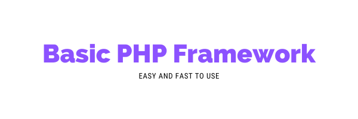

# [offy-basic-framework-php]
### Welcome! 
This is a basic framework written in php, easy and fast to use. In order to build small and large applications with scalability and, mainly, standardized!
## 🚀 Technologies

- [PHP](https://www.php.net/) 

## ✔️ Requirements

    - PHP 8.0.0
    
## Branchs
     
    
## 💻 Demo
